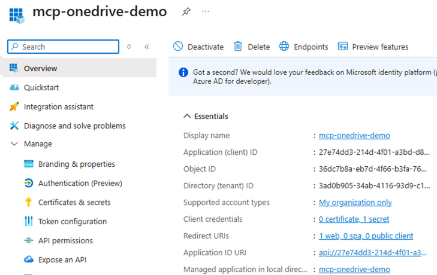
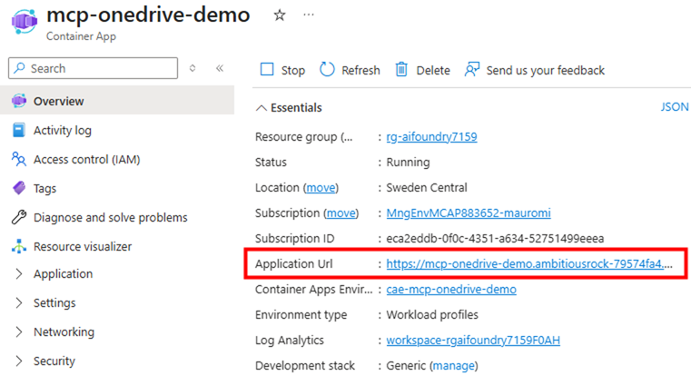
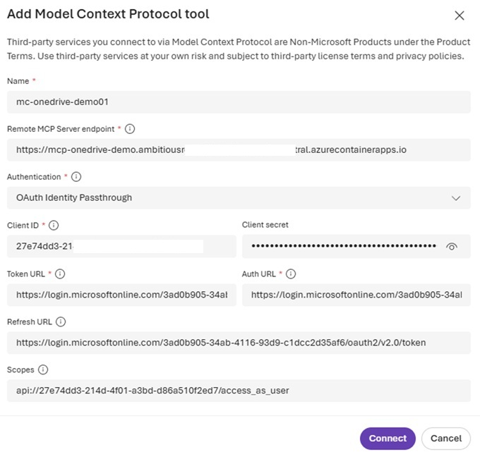
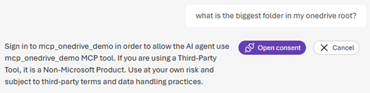
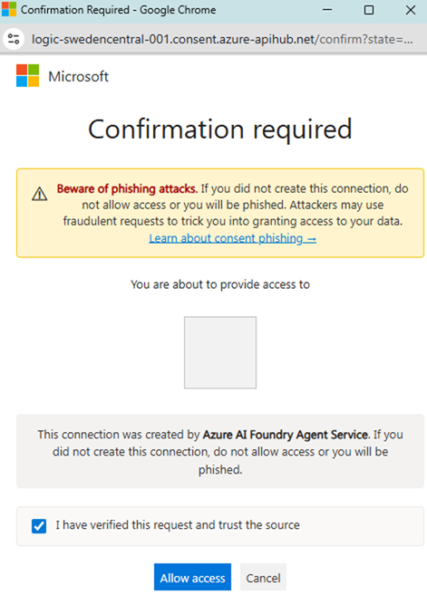
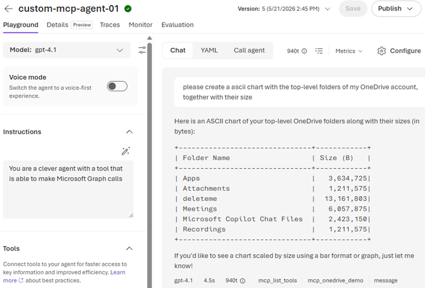
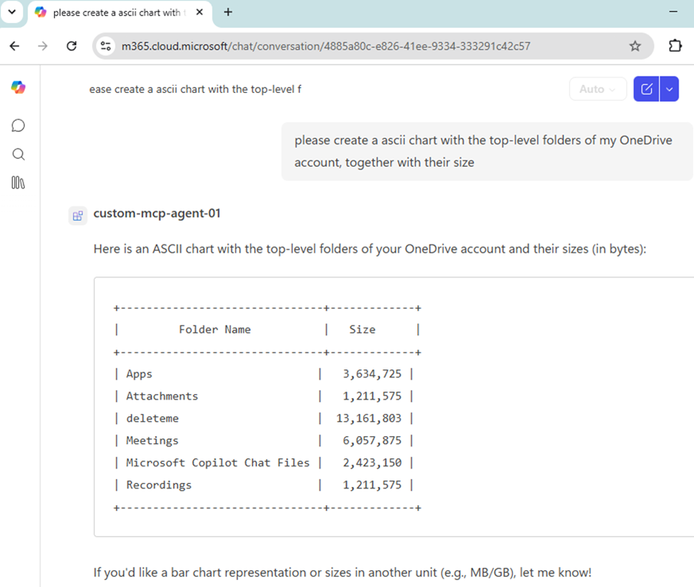

# mcp-onedrive-demo
Authenticated MCP Server with OBO to read user's files from their OneDrive through MS Graph


## What this sample demonstrates

[mcp_server.py](./mcp_server.py) implements a Python MCP server over HTTP that supports user-delegated access to Microsoft Graph via OAuth 2.0 On-Behalf-Of (OBO).

### Why it works
The server:
- reads the incoming bearer token from each MCP request,
- stores it per request,
- validates audience and scope for non-Graph tools,
- exchanges it through OBO when a Graph call is needed.

This design keeps the user identity end-to-end and avoids app-only access for user data.

### How it works
With the delegated Graph token obtained via OBO by the Uvicorn ASGI server app registration:



the server calls OneDrive endpoints (for example, `/me/drive/root/children`) and returns normalized tool output. This proves that actions run as the end user, not as an app-only identity.

#### Token model
- The incoming token is expected to target this app audience (`api://<client-id>`) with the configured delegated scope.
- For local testing (as shown in [mcp_client01.http](./mcp_client01.http)), I get a token with:
  `az account get-access-token --scope "${APP_ID_URI}/${SCOPE_VALUE}"`
- For tools that only need identity inspection, I decode JWT claims locally (no Graph call required).
- For OneDrive access, I run OBO with MSAL `ConfidentialClientApplication` (client ID, client secret, tenant authority).
- The OBO exchange requests delegated Graph permission (`Files.Read`) and returns a Graph access token.

### Hosting model
I use [Dockerfile](./Dockerfile) to build the container image in ACR, then deploy that image to Azure Container Apps (ACA):


Then I configure the MCP endpoint in a Foundry prompt agent with OAuth2 passthrough:


### Running in Microsoft Foundry Playground or in M365 Copilot
When a user prompt requires one of the MCP tools, Foundry/Copilot requests one-time user consent:


After consent, an interactive sign-in flow asks the user to authenticate against the MCP server. The resulting bearer token is stored by the Authentication Manager:


In this setup, Foundry does not mint an MCP-scoped token from a Foundry token. Instead, it relies on Credential Manager/Authentication Manager to forward the collected token to the MCP server when the tool is invoked.

### Final outcome
This is the result in **Foundry Playground**:



The behavior is effectively the same in **M365 Copilot**:


## Quick Start

### UV Installation
- On Linux / macOS: `curl -LsSf https://astral.sh/uv/install.sh | sh`
- On Windows: `powershell -ExecutionPolicy ByPass -c "irm https://astral.sh/uv/install.ps1 | iex"`

### Setup Steps
```bash
# 1. **MKDIR** the new folder and and **CD** into it

# 2 Create the environment
uv init . --python 3.13

# 3. Create the local virtual environment
uv venv

# 4. Activate the environment:
source .venv/bin/activate # on Linux/macOS
.\.venv\Scripts\activate.ps1 # on Windows

# 5. Add libraries (it's KEY to use `--active`):
uv add --active $(cat requirements.txt) --prerelease=allow # Automatically
uv add --active <package-name> --prerelease=allow # Manually

# 6. Check that the packges are installed
uv pip list

# 7. Synchronize to create the file structure (not needed in normal situations, just with pre-existing pyproject.toml
uv sync --active --prerelease=allow

# 8. List jupyter kernels
jupyter kernelspec list

# 9. Delete a jupyter kernel
jupyter kernelspec uninstall responses

# 10. Create kernel for the jupyter notebook
python -m ipykernel install --name responses --use

# 11. To deactivate
deactivate
```


## Running the Agent Locally: Local Container Build & Test
The .dockerignore intentionally excludes .env from the build context (so it never reaches Docker).
This is correct security behaviour: you should never bake secrets into an image.
So, don't use .env from the COPY instruction, but pass the .env at runtime instead:
```bash
# Build the image
docker build -t <image-name> .

# Run the container (mapping host port 8010 → container port 8000)
docker run -p 8010:8000 \
  -e AZURE_TENANT_ID=<your-tenant-id> \
  -e AZURE_CLIENT_ID=<your-client-id> \
  -e AZURE_CLIENT_SECRET=<your-client-secret> 
  <image-name>
  
# or, since they're already defined in your .env file, pass them without values to inherit from the current shell environment:
docker run -p 8010:8000 --env-file .env <image-name>

# or, in case of local debugging:
docker run                              # runs container
  -p 8010:8000 -p 5678:5678             # maps ports, inlcuding debugging port 5678
  --env-file .env                       # loads environment variables
  --entrypoint python                   # rather than "CMD" of Dockerfile, we use "python" as executable
  mcp-onedrive-demo                     # ← here use use our image name, listable with `docker images`
  -m debugpy --listen 0.0.0.0:5678 --wait-for-client mcp_server.py
  # ↑ questi sono gli argomenti passati a "python"
  # exquivalent to: `python -m debugpy --listen 0.0.0.0:5678 --wait-for-client mcp_server.py`

# just to copy'n'paste:
docker run \
  -p 8010:8000 -p 5678:5678 \
  --env-file .env \
  --entrypoint python \
  mcp-onedrive-demo \
  -m debugpy --listen 0.0.0.0:5678 --wait-for-client mcp_server.py

# such variables might be defined in our shell's startup file.
# For bash, append to ~/.bashrc (interactive shells) or ~/.bash_profile (login shells):
echo 'export AZURE_TENANT_ID=3ad***' >> ~/.bashrc
echo 'export AZURE_CLIENT_ID=31***' >> ~/.bashrc
echo 'export AZURE_CLIENT_SECRET=F5***' >> ~/.bashrc
source ~/.bashrc
```


## Additional Resources

- [Microsoft Agents Framework](https://learn.microsoft.com/en-us/agent-framework/overview/agent-framework-overview)
- [Managed Identities for Azure Resources](https://learn.microsoft.com/en-us/entra/identity/managed-identities-azure-resources/)
