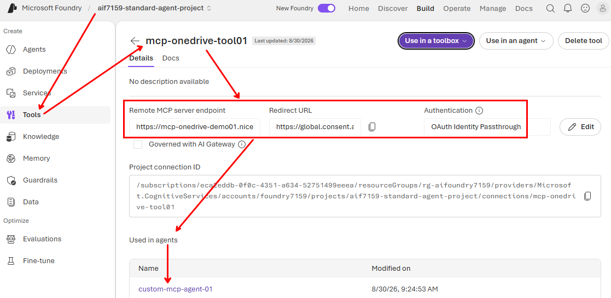

# Toolboxes' in Microsoft Foundry

## Documentation
- Announcement: https://devblogs.microsoft.com/foundry/building-agents-that-act-on-your-behalf-with-toolboxes-in-foundry/
- How they work: https://learn.microsoft.com/en-us/azure/foundry/agents/how-to/tools/toolbox?pivots=python

## Starting point
In my Foundry project I already created the connection to my existing MCP tool, setting the authentication as `OAuth Identity Passthrough`:
```bash
azd extension update --all

azd auth login

connection_name=mcp-onedrive-tool01
project_endpoint=https://fo***59.services.ai.azure.com/api/projects/aif7159-standard-agent-project

azd ai connection create $connection_name \
  -p $project_endpoint \
  --kind remote-tool \
  --target https://mcp-onedrive-demo01.niceflower-8b4a0311.swedencentral.azurecontainerapps.io/mcp \
  --auth-type oauth2 \
  --authorization-url https://login.microsoftonline.com/3ad0b905-34ab-4116-93d9-c1dcc2d35af6/oauth2/v2.0/authorize \
  --token-url https://login.microsoftonline.com/3ad0b905-34ab-4116-93d9-c1dcc2d35af6/oauth2/v2.0/token \
  --refresh-url https://login.microsoftonline.com/3ad0b905-34ab-4116-93d9-c1dcc2d35af6/oauth2/v2.0/token \
  --client-id 15***5c \
  --client-secret UGk***JV \
  --scopes "api://mcp/15***5c/access_as_user offline_access"

azd ai connection show $connection_name \
  -p $project_endpoint

>>> OUTPUT
Connection "mcp-onedrive-tool01" created in project "aif7159-standard-agent-project".
Name:      mcp-onedrive-tool01
Kind:      RemoteTool
Auth_Type: OAuth2
Target:    https://mcp-onedrive-demo01.niceflower-8b4a0311.swedencentral.azurecontainerapps.io/mcp
```

This tool is visible in Microsoft Foundry and is already connected to a prompt agent:


## Setup Steps
```bash
# 1. **MKDIR** the new folder and and **CD** into it

# 2 Create the environment
uv init . --python 3.13

# 3. Create the local virtual environment
uv venv

# 4. Activate the environment:
source .venv/bin/activate # on Linux/macOS
.\.venv\Scripts\activate.ps1 # on Windows

# 5. Add libraries (it's KEY to use `--active`):
uv add --active $(cat requirements.txt) --prerelease=allow # Automatically
uv add --active <package-name> --prerelease=allow # Manually

# 6. Check that the packges are installed
uv pip list

# 7. Synchronize to create the file structure (not needed in normal situations, just with pre-existing pyproject.toml
uv sync --active --prerelease=allow

# 8. List jupyter kernels
jupyter kernelspec list

# 9. Delete a jupyter kernel
jupyter kernelspec uninstall responses

# 10. Create kernel for the jupyter notebook
python -m ipykernel install --name responses --use

# 11. To deactivate
deactivate
```